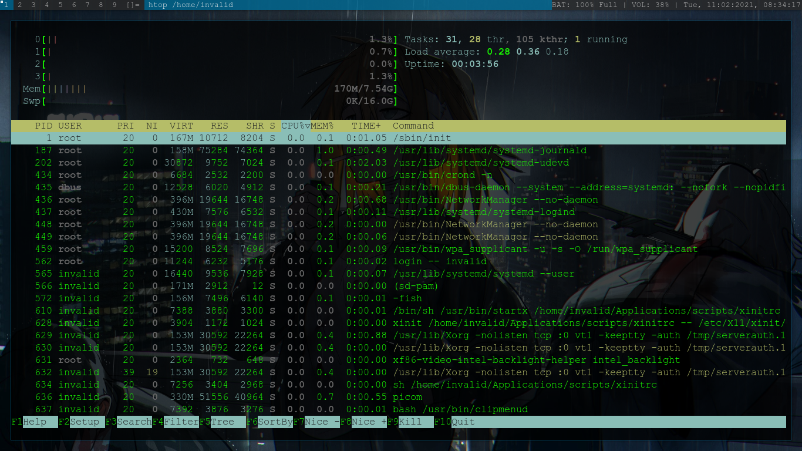

# setup.zip
boot the arch installation media and get base-install.sh and execute it for the minimal installation of arch linux.

Then, after reboot, login with regular user, get post-install.sh and execute it to get my dwm setup. 
### Incluings
 - setup.zip
 	- Applications
 		- scripts(included xinitrc file and dwm_bar (pulseaudio, battery and date and time)
 		- suckless
 			- dwm-6.2	(my build of dwm; alpha+fullgaps patch applied and some shortcuts added)
 			- slock-1.4	(my build of slock; unlock_screen patch applied)
 	- main
 		- home
 			- .config (contains configuration files of some basic packages)
 		- root
 			- .config (contains configuration files of some basic packages)
 	- others (contains settings for synaptic touchpad options)
 	- supports (contains additional helper files creating this script)
 	- base-install.sh (base installation of arch in few clicks)
  - post-install.sh (get my arch dwm setup in a click)

### Usage
 1. Get the base-installation script in your arch installation media, make it executable and execute it to get base system of arch.
```
curl https://raw.githubusercontent.com/YogeshLamichhane/setup.zip/main/base-install.sh > base-install.sh && chmod +x base-install.sh && ./base-install.sh
```
 2. After reboot, login with regular user you created, and then get the post-installation script, make it executable and execute the script.
```
curl https://raw.githubusercontent.com/YogeshLamichhane/setup.zip/main/post-install.sh > post-install.sh && chmod +x post-install.sh && ./post-install.sh
```


## Preview of my setup
#### Uses just 165-175 MB of RAM at innitial boot


### DWM Shortcuts
default mod key is the Alt key.
|  Shortcut Keys  | Task | Command Executed |
| :-------------: | :--: | :--------------: |
| 	Volume_Up	  | Increase volume by 5% using pactl | pactl set-sink-volume +5% |
| 	Volume_Down   | Decrease volume by 5% using pactl | pactl set-sink-volume -5% |
|  Brightness_Up  | Increase brightness by 5% using xbacklight | xbacklight -inc 5 |
| Brightness_Down | Decrease brightness by 5% using xbacklight | xbacklight -dec 5 |
| 	Super + b 	  | Opens Brave browser | brave |
| 	Super + c 	  | Opens Clipmenu clipboard manager | clipmenu |
| 	Super + m 	  | Opens Thunderbird mail client | thunderbird |
| 	Super + n 	  | Opens networkmanager_dmenu_git (aur package) | networkmanager_dmenu |
| 	Super + s 	  | Screenshot using scrot and save it $HOME/Pictures/Screenshots/ | scrot $HOME/Pictures/Screenshots/screenshot.png |
| 	Super + t 	  | Opens Mousepad text editor | mousepad |
| 	Super + v 	  | Opens pavucontrol volume control | pavucontrol |
| 	Mod + Shift + Enter | Opens Alacritty terminal | alacritty |
| Super + shift + s | Take screenshot of selected portion of screen using scrot and save it in $HOME/Pictures/Screenshots/ | scrot -s $HOME/Pictures/Screenshots/screenshot.png |

#### Note: All the shortcuts are directly added to [dwm config file](https://github.com/YogeshLamichhane/setup.zip/blob/main/Applications/suckless/dwm-6.2/config.def.h).

#### Just A Note for myself
get the list of all the installed packages in arch based machine: `pacman -Q | awk '{print $1}' > packages.txt`
